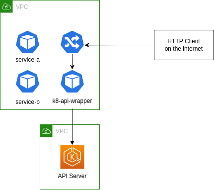

# K8-API-WRAPPER 
Simple HTTP API that exposes to the internet K8 pod information. This is intended to use for cluster that run privatelly, and developers might not have access to the cluster. This exposes through a REST API an option to access pods information.

